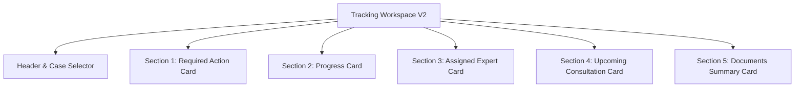
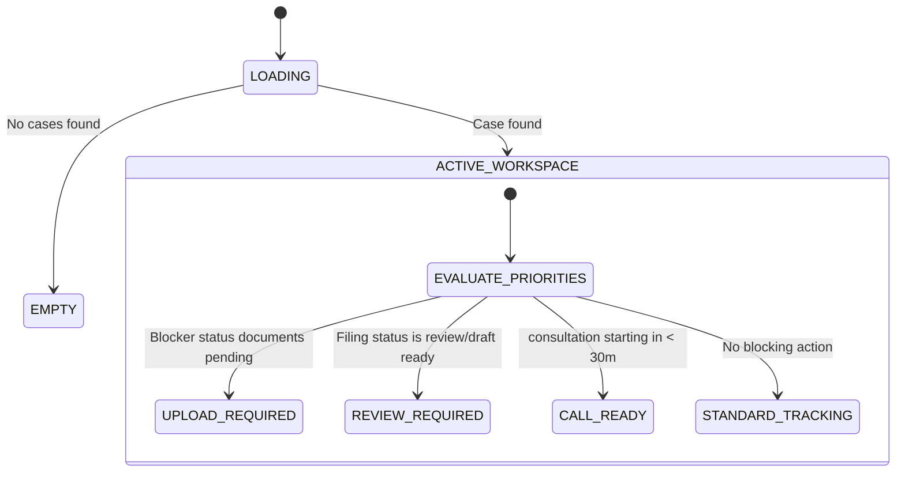

# BlueprintCaseWorkspaceV2

## 1. Product Requirements Document (PRD)

### Objective
Reduce anxiety and cognitive load for users checking their active compliance requests. Make the workspace screen answer exactly one question: **"What should I do next?"**

### Success Metrics
* Case workspace interaction time < 10 seconds.
* Blocker resolution time reduced by 30%.
* Increase in document upload success rates.

### User Priorities
1. Is there an active blocker/action item requiring my attention?
2. What is the current progress of my case?
3. Who is the assigned expert managing my case?
4. When is my next consultation call?
5. How many documents have been uploaded vs. are pending?

---

## 2. Functional Design Document (FDR)

### Section 1: Required Action Card
*   Displays exactly one highest-priority blocker or pending step (e.g., Upload Form 16, Review Draft Return, Join Consultation, Sign Filing).
*   Contains exactly one primary CTA button (e.g., Upload Now, Review Draft, Join Call, Sign Now).

### Section 2: Progress Card
*   Displays current filing stage, percentage completion, next milestone, and estimated completion ETA.
*   Includes a visual progress ring with spring animation.

### Section 3: Assigned Expert Card
*   Displays photo, name, specialization, response SLA, and a "Chat" CTA to open the dedicated Chat tab.
*   Maximum 1 expert visible.

### Section 4: Upcoming Consultation Card
*   Collapsed by default.
*   Displays date, time, mode, and a "Join Call" CTA.
*   Expandable to show rescheduling options, notes, and meeting history.

### Section 5: Documents Summary Card
*   Shows summary counts: Uploaded (e.g., 2 / 5) and Pending (e.g., 3).
*   Contains a single CTA: "Manage Documents" (opens a separate screen or overlay).
*   Does not show the entire checklist on the workspace.

---

## 3. Component Tree

---

## 4. State Machine

---

## 5. Analytics Events
*   `workspace_viewed`: Fired upon entering the case workspace view.
*   `primary_action_clicked`: Fired when the main CTA in the Required Action Card is clicked.
*   `expert_contacted`: Fired when clicking the Chat CTA on the expert card.
*   `consultation_joined`: Fired when joining a call.
*   `documents_opened`: Fired when clicking "Manage Documents".

---

## 6. Accessibility Spec
*   Minimum 48dp touch targets on all interactive elements.
*   Descriptive `aria-label` tags for screen readers (e.g., `aria-label="Manage documents, 2 of 5 uploaded"`).
*   Dynamic type compatibility using relative typography sizing.
*   Support for `prefers-reduced-motion` CSS rules.

---

## 7. Animation Spec
*   **Progress Ring**: CSS stroke-dasharray transition using cubic-bezier spring simulation.
*   **Timeline / Transitions**: Slide-up fade-in transition of 300ms.
*   **Expandable Cards**: Max-height animation with smooth CSS easing on card toggle.

---

## 8. Empty States
*   **No Active Filings**: Displays a clean "No Active Filings" banner with a CTA to return to the home screen to book a consultation.

---

## 9. Error States
*   **Connection Error**: Offline warning banner displaying cached local snapshot.

---

## 10. Loading States
*   **Skeletons**: Shimmer skeletons matching the exact dimensions of the 5 cards.

---

## 11. Standard Operating Procedure (SOP)
1. Initialize case workspace and evaluate priorities.
2. Render skeleton loader during metadata fetching.
3. Determine active case and display Section 1 action blocker if applicable.
4. Render progress ring, expert profile, upcoming calls, and doc summary.
5. Handle drawer/sub-screen transitions for manage documents, rescheduling, and timeline.
